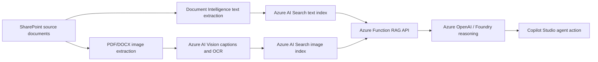

# Renewable Compliance Reviewer lab

This repo packages a repeatable lab for a multimodal renewable-energy compliance agent. It ingests SharePoint documents, extracts text and visual evidence, indexes both in Azure AI Search, reasons over the evidence with Azure OpenAI in Foundry, and exposes the result as a Copilot Studio custom connector action.

## What the lab builds



The current reference run produced:

| Asset | Count |
| --- | ---: |
| SharePoint source documents | 15 |
| Searchable text chunks | 1,371 |
| Indexed visual records | 1,908 |
| Azure AI Vision successes | 1,630 |

The source documents and extracted images are not committed to this repo. They stay in SharePoint.

## Repo layout

| Path | Purpose |
| --- | --- |
| `ingest_sharepoint_to_search.py` | Pulls SharePoint files, extracts/OCRs text, chunks content, and indexes text into Azure AI Search. |
| `extract_images_to_search.py` | Extracts embedded PDF/DOCX/PPTX images, renders PDF pages, uploads image assets to SharePoint, runs Vision caption/OCR, and indexes visual records. |
| `data/` | Visible lab data layout, reference corpus manifest, source/extracted placeholders, and sample reasoning questions. |
| `reccia-agent-api/` | Azure Function HTTP API that queries both Search indexes and calls Azure OpenAI for grounded reasoning. |
| `reccia-agent-api/connector/` | Swagger 2.0 and connector properties for Copilot Studio / Power Platform custom connector import. |
| `scripts/` | Parameterized setup, ingestion, deployment, connector, and test scripts. |
| `copilot/` | Reusable Copilot Studio action and connection-reference templates. |
| `prompts/` | Reusable Copilot Studio and Foundry reasoning prompts. |
| `docs/` | Architecture, processing pipeline, Copilot setup, and troubleshooting notes. |
| `assets/` | Intro slide deck and preview image for workshop/lab setup. |

## Prerequisites

1. Azure CLI signed in with rights to create Azure AI Search, Cognitive Services, Azure OpenAI, Storage, and Azure Functions.
2. Python 3.11+.
3. Power Platform CLI (`pac`) for Copilot Studio agent and custom connector operations.
4. Power Apps maker/admin access to the target Dataverse environment.
5. A SharePoint document library folder containing PDF/DOCX/PPTX source documents.

## Quickstart

```powershell
python -m venv .venv
.\.venv\Scripts\python.exe -m pip install -r requirements.txt

.\scripts\deploy-azure-resources.ps1 `
  -SubscriptionId "<subscription-id>" `
  -ResourceGroupName "rg-reccia-graph-ingestion" `
  -Location "eastus" `
  -NamePrefix "reccia"

.\scripts\run-text-ingestion.ps1 `
  -SubscriptionId "<subscription-id>" `
  -ResourceGroupName "rg-reccia-graph-ingestion" `
  -SearchServiceName "<search-service>" `
  -DocumentIntelligenceAccountName "<doc-intel-account>" `
  -DriveId "<sharepoint-drive-id>"

.\scripts\run-image-extraction.ps1 `
  -SubscriptionId "<subscription-id>" `
  -ResourceGroupName "rg-reccia-graph-ingestion" `
  -SearchServiceName "<search-service>" `
  -VisionAccountName "<vision-account>" `
  -DriveId "<sharepoint-drive-id>" `
  -RenderPages `
  -SkipExistingIndexed

.\scripts\deploy-function-api.ps1 `
  -SubscriptionId "<subscription-id>" `
  -ResourceGroupName "rg-reccia-graph-ingestion" `
  -FunctionAppName "<function-app>" `
  -StorageAccountName "<storage-account>" `
  -SearchServiceName "<search-service>" `
  -OpenAIAccountName "<openai-account>" `
  -OpenAIDeploymentName "gpt-4.1-mini"

.\scripts\test-reccia-api.ps1 `
  -SubscriptionId "<subscription-id>" `
  -ResourceGroupName "rg-reccia-graph-ingestion" `
  -FunctionAppName "<function-app>"
```

Then register the Copilot Studio custom connector:

```powershell
.\scripts\register-copilot-action.ps1 `
  -SubscriptionId "<subscription-id>" `
  -ResourceGroupName "rg-reccia-graph-ingestion" `
  -FunctionAppName "<function-app>" `
  -EnvironmentUrl "https://<org>.crm.dynamics.com/" `
  -EnvironmentId "<environment-id>" `
  -BotSchemaName "reccia_RenewableComplianceReviewer"
```

## Demo prompts

- Find all permitting checklists and summarize the required steps.
- Show me diagrams related to solar interconnection or approval workflow.
- What documentation would a municipality require before approving this solar project?
- Compare this permit application template against the California permitting guide.
- Find visuals or tables that explain fees, timelines, or zoning constraints.

## Security notes

- Do not commit `.env`, `local.settings.json`, function keys, Search keys, storage connection strings, PAC auth files, or Copilot Studio `.mcs` sync metadata.
- The Function uses a Search query key, not an admin key, at runtime.
- The Copilot custom connector stores the Azure Function key in a Power Platform connection.
- Authenticated SharePoint image URLs should be returned as normal links, not inline Markdown images, because Copilot Studio chat cannot reliably render protected SharePoint image files inline.
