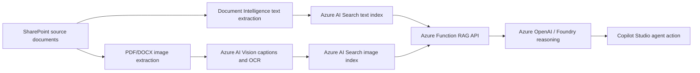

# Renewable Energy Compliance Lab

**RECCIA** stands for **Renewable Energy Contract and Compliance Intelligence Agent**. The RECCIA lab shows how to build a Copilot Studio agent that can answer renewable-energy permitting, zoning, interconnection, contracting, and compliance questions from both document text and extracted visual evidence.

This repo packages a repeatable lab for a multimodal renewable-energy compliance agent. It ingests SharePoint documents, extracts text and visual evidence, indexes both in Azure AI Search, reasons over the evidence with Azure OpenAI in Foundry, and exposes the result as a Copilot Studio custom connector action.

## What the lab builds



The current reference run produced:

| Asset | Count |
| --- | ---: |
| SharePoint source documents | 15 |
| Searchable text chunks | 1,371 |
| Indexed visual records | 1,908 |
| Azure AI Vision successes | 1,630 |

The public corpus source list is included under `data/document-index.csv`. The lab bootstrap script downloads those public documents and uploads them into your SharePoint document library before ingestion.

**Full lab guide:** [RECCIA Lab Guide](docs/RECCIA-Lab-Guide.docx) provides the end-to-end implementation walkthrough, validation checklist, troubleshooting matrix, and sign-off template.

## Repo layout

| Path | Purpose |
| --- | --- |
| `ingest_sharepoint_to_search.py` | Pulls SharePoint files, extracts/OCRs text, chunks content, and indexes text into Azure AI Search. |
| `extract_images_to_search.py` | Extracts embedded PDF/DOCX/PPTX images, renders PDF pages, uploads image assets to SharePoint, runs Vision caption/OCR, and indexes visual records. |
| `data/` | Corpus source index, reference manifest, source/extracted placeholders, and sample reasoning questions. |
| `infra/` | Bicep template for Azure AI Search, Document Intelligence, Vision, Azure OpenAI, Storage, Application Insights, and Azure Functions. |
| `reccia-agent-api/` | Azure Function HTTP API that queries both Search indexes and calls Azure OpenAI for grounded reasoning. |
| `reccia-agent-api/connector/` | Swagger 2.0 and connector properties for Copilot Studio / Power Platform custom connector import. |
| `scripts/` | Parameterized setup, ingestion, deployment, connector, and test scripts. |
| `copilot/` | Reusable Copilot Studio action and connection-reference templates. |
| `prompts/` | Reusable Copilot Studio and Foundry reasoning prompts. |
| `docs/` | Architecture, processing pipeline, Copilot setup, and troubleshooting notes. |
| `docs/RECCIA-Lab-Guide.docx` | Complete 40-page instructor-style implementation lab guide. |
| `assets/` | Intro slide deck and preview image for workshop/lab setup. |

## Prerequisites

1. Azure CLI signed in with rights to create Azure AI Search, Cognitive Services, Azure OpenAI, Storage, and Azure Functions.
2. Python 3.11+.
3. Power Platform CLI (`pac`) for Copilot Studio agent and custom connector operations.
4. Power Apps maker/admin access to the target Dataverse environment.
5. A SharePoint document library folder containing PDF/DOCX/PPTX source documents.

## Azure resources and purpose

The Bicep template deploys these resources because each one owns a specific part of the RECCIA pipeline:

| Resource | Why it is deployed |
| --- | --- |
| Azure AI Search | Stores and queries the two retrieval indexes: `reccia-documents` for text chunks and `reccia-images` for visual evidence. |
| Azure AI Document Intelligence | Extracts layout-aware text from PDF and DOCX source documents so the content can be chunked and indexed for retrieval. |
| Azure AI Vision | Captions, OCRs, and tags extracted images, rendered PDF pages, diagrams, checklists, and tables before they are indexed. |
| Azure OpenAI account and chat model deployment | Synthesizes grounded answers from the retrieved text and visual evidence using the configured chat model, such as `gpt-4.1-mini`. |
| Storage account for Azure Functions | Provides the Function App runtime storage used for triggers, host state, deployment packages, and execution metadata. |
| Application Insights | Captures Function telemetry, failures, latency, and traces so the reasoning API can be diagnosed during lab runs. |
| Linux Azure Function App | Hosts the `askRenewableCompliance` HTTP API that queries both Search indexes, calls Azure OpenAI, and returns cited answers to Copilot Studio. |
| Managed identity role assignment for the Function App to call Azure OpenAI | Lets the Function call Azure OpenAI with Entra identity instead of embedding Azure OpenAI keys in code or app settings. |

## Quickstart

```powershell
python -m venv .venv
.\.venv\Scripts\python.exe -m pip install -r requirements.txt

.\scripts\deploy-azure-resources.ps1 `
  -SubscriptionId "<subscription-id>" `
  -ResourceGroupName "rg-reccia-graph-ingestion" `
  -Location "eastus" `
  -NamePrefix "reccia"
```

The deployment script uses `infra\main.bicep` to create the required Azure resources.

```powershell

.\scripts\bootstrap-sharepoint-corpus.ps1 `
  -SubscriptionId "<subscription-id>" `
  -DriveId "<sharepoint-drive-id>" `
  -DocumentIndexPath "data\document-index.csv" `
  -SourceFolder "Source Documents"

.\scripts\run-text-ingestion.ps1 `
  -SubscriptionId "<subscription-id>" `
  -ResourceGroupName "rg-reccia-graph-ingestion" `
  -SearchServiceName "<search-service>" `
  -DocumentIntelligenceAccountName "<doc-intel-account>" `
  -DriveId "<sharepoint-drive-id>"

.\scripts\run-image-extraction.ps1 `
  -SubscriptionId "<subscription-id>" `
  -ResourceGroupName "rg-reccia-graph-ingestion" `
  -SearchServiceName "<search-service>" `
  -VisionAccountName "<vision-account>" `
  -DriveId "<sharepoint-drive-id>" `
  -RenderPages `
  -SkipExistingIndexed

.\scripts\deploy-function-api.ps1 `
  -SubscriptionId "<subscription-id>" `
  -ResourceGroupName "rg-reccia-graph-ingestion" `
  -FunctionAppName "<function-app>" `
  -StorageAccountName "<storage-account>" `
  -SearchServiceName "<search-service>" `
  -OpenAIAccountName "<openai-account>" `
  -OpenAIDeploymentName "gpt-4.1-mini"

.\scripts\test-reccia-api.ps1 `
  -SubscriptionId "<subscription-id>" `
  -ResourceGroupName "rg-reccia-graph-ingestion" `
  -FunctionAppName "<function-app>"
```

Then register the Copilot Studio custom connector:

```powershell
.\scripts\register-copilot-action.ps1 `
  -SubscriptionId "<subscription-id>" `
  -ResourceGroupName "rg-reccia-graph-ingestion" `
  -FunctionAppName "<function-app>" `
  -EnvironmentUrl "https://<org>.crm.dynamics.com/" `
  -EnvironmentId "<environment-id>" `
  -BotSchemaName "reccia_RenewableComplianceReviewer"
```

## Manual deployment

Use this path when you want to deploy the lab step by step instead of running the whole setup as a single workshop flow.

1. **Clone and prepare the repo.**

   ```powershell
   git clone https://github.com/spetren/renewable-energy-compliance-lab.git
   cd renewable-energy-compliance-lab
   python -m venv .venv
   .\.venv\Scripts\python.exe -m pip install -r requirements.txt
   Copy-Item .env.example .env
   ```

2. **Create the Azure resource group and deploy the Bicep template.**

   ```powershell
   $subscriptionId = "<subscription-id>"
   $resourceGroupName = "rg-reccia-lab"
   $location = "eastus"
   $namePrefix = "reccia"

   az account set --subscription $subscriptionId
   az group create --name $resourceGroupName --location $location
   az deployment group create `
     --resource-group $resourceGroupName `
     --template-file infra\main.bicep `
     --parameters `
       namePrefix=$namePrefix `
       location=$location `
       openAIDeploymentName="gpt-4.1-mini" `
       openAIModelName="gpt-4.1-mini" `
       openAIModelVersion="2025-04-14"
   ```

   Record the generated Search, Document Intelligence, Vision, Azure OpenAI, Storage, and Function App names in `.env` and Appendix A of the lab guide.

3. **Prepare SharePoint for the corpus.**

   Create or choose a SharePoint document library, create a `Source Documents` folder, and resolve the library's Microsoft Graph drive ID. Then either upload your own renewable-energy PDFs/DOCX files manually or bootstrap the public corpus from `data\document-index.csv`:

   ```powershell
   .\scripts\bootstrap-sharepoint-corpus.ps1 `
     -SubscriptionId $subscriptionId `
     -DriveId "<sharepoint-drive-id>" `
     -DocumentIndexPath "data\document-index.csv" `
     -SourceFolder "Source Documents"
   ```

4. **Run text ingestion.**

   ```powershell
   .\scripts\run-text-ingestion.ps1 `
     -SubscriptionId $subscriptionId `
     -ResourceGroupName $resourceGroupName `
     -SearchServiceName "<search-service>" `
     -DocumentIntelligenceAccountName "<doc-intel-account>" `
     -DriveId "<sharepoint-drive-id>"
   ```

   Continue only after `reccia-documents` has a non-zero document count and Search explorer returns cited text results.

5. **Run visual evidence extraction.**

   ```powershell
   .\scripts\run-image-extraction.ps1 `
     -SubscriptionId $subscriptionId `
     -ResourceGroupName $resourceGroupName `
     -SearchServiceName "<search-service>" `
     -VisionAccountName "<vision-account>" `
     -DriveId "<sharepoint-drive-id>" `
     -RenderPages `
     -SkipExistingIndexed
   ```

   Use `-SkipExistingIndexed` on every retry so interrupted long runs resume without reprocessing completed images.

6. **Deploy and test the reasoning API.**

   ```powershell
   .\scripts\deploy-function-api.ps1 `
     -SubscriptionId $subscriptionId `
     -ResourceGroupName $resourceGroupName `
     -FunctionAppName "<function-app>" `
     -StorageAccountName "<storage-account>" `
     -SearchServiceName "<search-service>" `
     -OpenAIAccountName "<openai-account>" `
     -OpenAIDeploymentName "gpt-4.1-mini"

   .\scripts\test-reccia-api.ps1 `
     -SubscriptionId $subscriptionId `
     -ResourceGroupName $resourceGroupName `
     -FunctionAppName "<function-app>"
   ```

   The test should return `reasoningMode: foundry`, a populated answer, and document or image citations.

7. **Register the Copilot Studio connector and action.**

   ```powershell
   .\scripts\register-copilot-action.ps1 `
     -SubscriptionId $subscriptionId `
     -ResourceGroupName $resourceGroupName `
     -FunctionAppName "<function-app>" `
     -EnvironmentUrl "https://<org>.crm.dynamics.com/" `
     -EnvironmentId "<environment-id>" `
     -BotSchemaName "reccia_RenewableComplianceReviewer"
   ```

   Confirm the Power Platform connection is `Connected` and the Dataverse connection reference has `connectionid` populated.

8. **Create, configure, and publish the Copilot Studio agent.**

   Create or clone the agent named `Renewable Compliance Reviewer`, add the `SearchKnowledge` action from `copilot\actions`, paste the instructions from `prompts\copilot-agent-instructions.md`, set `gptCapabilities.webBrowsing: false`, then push and publish with `pac copilot`.

9. **Validate the deployment.**

   In the Copilot Studio test pane, run the prompts in the **Demo prompts** section. Text answers should cite source documents and pages. Visual answers should return normal `[View diagram](url)` links, not inline image Markdown.

## Demo prompts

- Find all permitting checklists and summarize the required steps.
- Show me diagrams related to solar interconnection or approval workflow.
- What documentation would a municipality require before approving this solar project?
- Compare this permit application template against the California permitting guide.
- Find visuals or tables that explain fees, timelines, or zoning constraints.

## Security notes

- Do not commit `.env`, `local.settings.json`, function keys, Search keys, storage connection strings, PAC auth files, or Copilot Studio `.mcs` sync metadata.
- The Function uses a Search query key, not an admin key, at runtime.
- The Copilot custom connector stores the Azure Function key in a Power Platform connection.
- Authenticated SharePoint image URLs should be returned as normal links, not inline Markdown images, because Copilot Studio chat cannot reliably render protected SharePoint image files inline.
